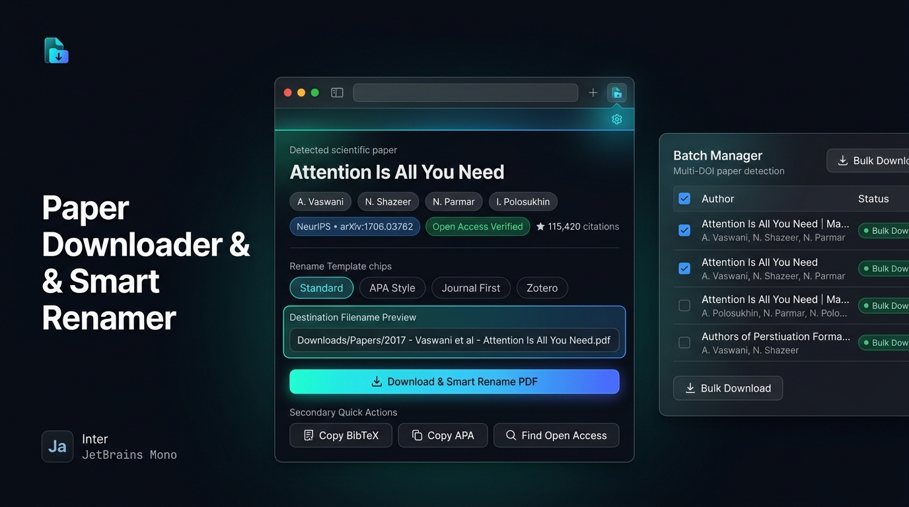

# 📄 Paper Downloader & Smart Renamer

[](https://developer.chrome.com/docs/extensions/mv3/)
[](https://unpaywall.org/)
[](https://crossref.org)
[](https://github.com)
[](https://github.com)

<p align="center">
  
</p>

> A modern, elegant Chrome extension (Manifest V3) that auto-detects research papers on any journal or preprint site, queries authoritative academic metadata (Crossref, arXiv, Semantic Scholar, Unpaywall, PubMed), discovers legal Open Access PDFs, smart-renames downloads into customizable author-year-title formats, and routes them cleanly into your Downloads folder.

---

## 🌟 Key Features

- 🔍 **Multi-DOI Sniffer & Bulk Detection**: Automatically scans pages (such as lab publications lists, bibliographies, Google Scholar, and literature reviews) for **all DOIs, arXiv IDs, and PubMed PMIDs**, not just the first one found.
- 📚 **Batch Paper Manager**: Dedicated batch interface with paper search/filtering, multi-select checkboxes, one-click **Batch Download** with rate throttling, and bulk BibTeX export.
- 📑 **Single Paper Explorer**: Switch between detected papers on multi-publication pages with a quick dropdown or previous/next buttons.
- 🏷️ **Intelligent Renaming Engine**: Customizable naming templates with token replacement:
  - `{year}` — Publication year
  - `{first_author}` — First author's last name
  - `{last_author}` — Senior / last author's last name
  - `{authors_et_al}` — First author + "et al" if multiple authors
  - `{authors}` — Up to 3 comma-separated author surnames
  - `{title}` — Paper title (sanitized and length-capped)
  - `{journal}` — Journal or venue name
  - `{doi_slug}` — Safe DOI identifier
  - `{arxiv_id}` — arXiv identifier
- 📂 **Subfolder Routing**: Automatically routes saved PDFs into `Downloads/Papers/` (or any custom folder name).
- 🔓 **Legal Open Access Discovery**: Direct Unpaywall API integration to locate free, legal Open Access repository PDFs for paywalled articles.
- 📋 **Authoritative BibTeX & APA**: One-click citation extraction via official DOI content negotiation.
- ⚡ **Zero-Build Vanilla MV3**: Extremely lightweight Chrome Manifest V3 extension with native dark-mode academic glassmorphism UI.
* **Right-Click Context Menus**: Highlight any DOI or right-click any paper link to immediately download or copy citations.
* **Keyboard Shortcut (`Alt+P`)**: Instantly trigger quick download and smart renaming from anywhere.
* **Full Options Page**: Includes an interactive live sandbox to test and build custom template patterns.

---

## 📁 Project Structure

```
paper_downloader/
├── manifest.json            # Manifest V3 specification
├── config.js                # Templates, token extractors, regexes, API settings
├── background.js            # MV3 service worker (API cascades, downloads, context menus)
├── content.js               # In-page paper sniffer (<meta> tags, raw PDF detection)
├── popup.html               # Modern glassmorphic popup interface
├── popup.css                # Polished dark academic design system
├── popup.js                 # Popup reactive controller & action handlers
├── options.html             # Full preferences page with live sandbox
├── options.css              # Options page design system
├── options.js               # Options page interactive logic & storage sync
├── assets/                  # UI showcase & documentation assets (preview banner)
├── icons/                   # High-resolution extension icons (16, 32, 48, 128)
└── README.md                # Documentation & user guide
```

---

## 🚀 Installation & Loading into Chrome

1. Open Google Chrome, Microsoft Edge, or Brave and navigate to:
   ```text
   chrome://extensions/
   ```
2. Enable **Developer Mode** using the toggle switch in the top-right corner.
3. Click the **Load unpacked** button in the top-left corner.
4. Select the repository folder:
   ```text
   E:\GitHub\paper_downloader
   ```
5. Pin **Paper Downloader & Smart Renamer** to your toolbar.

---

## 📖 How to Use

1. Navigate to any research paper page (e.g. on [arXiv](https://arxiv.org/abs/1706.03762), [Nature](https://www.nature.com/articles/s41586-020-2649-2), [bioRxiv](https://www.biorxiv.org/content/10.1101/2023.01.23.525140v1), ScienceDirect, or PubMed).
2. Click the **Paper Downloader** icon in your browser toolbar (or press `Alt+P`).
3. The popup displays:
   * Verified publication title & author chips
   * Venue & year of publication
   * Citation count & Open Access status badge
   * Clean, formatted target filename preview
4. Click **📥 Download & Smart Rename PDF** — saved directly to `Downloads/Papers/`!
5. Need citations? Click **📋 Copy BibTeX** or **📎 Copy APA** for instant clipboard export.
6. On a paywalled article? Click **🔓 Find Open Access** to automatically locate and link a free, legal PDF copy via Unpaywall.

---

## ⚙️ Template Tokens

You can customize your renaming pattern using these tokens:

| Token | Description | Example |
| :--- | :--- | :--- |
| `{year}` | 4-digit publication year | `2024` |
| `{first_author}` | Last name of first author | `Vaswani` |
| `{last_author}` | Last name of last author | `Polosukhin` |
| `{authors_et_al}` | Author list with "et al." | `Vaswani et al` |
| `{authors}` | First 3 authors | `Vaswani, Shazeer, Parmar` |
| `{title}` | Sanitized paper title | `Attention Is All You Need` |
| `{journal}` | Journal or repository name | `NeurIPS` / `arXiv` |
| `{doi_slug}` | DOI with slashes converted to `_` | `10.1038_s41586-024-00000` |
| `{arxiv_id}` | Clean arXiv identifier | `1706.03762` |

